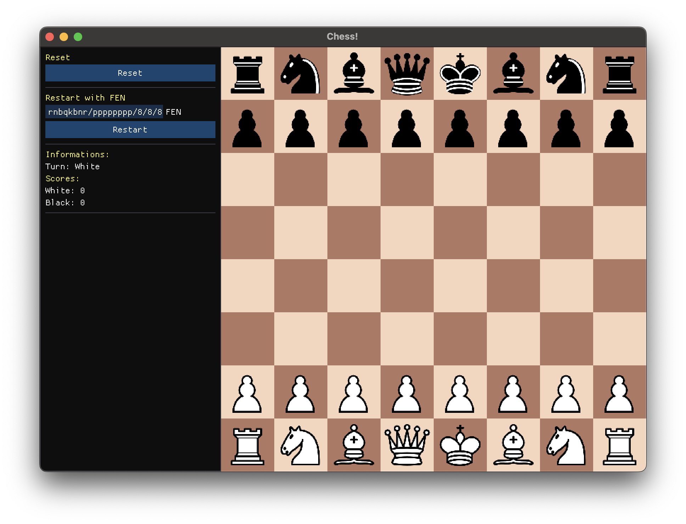
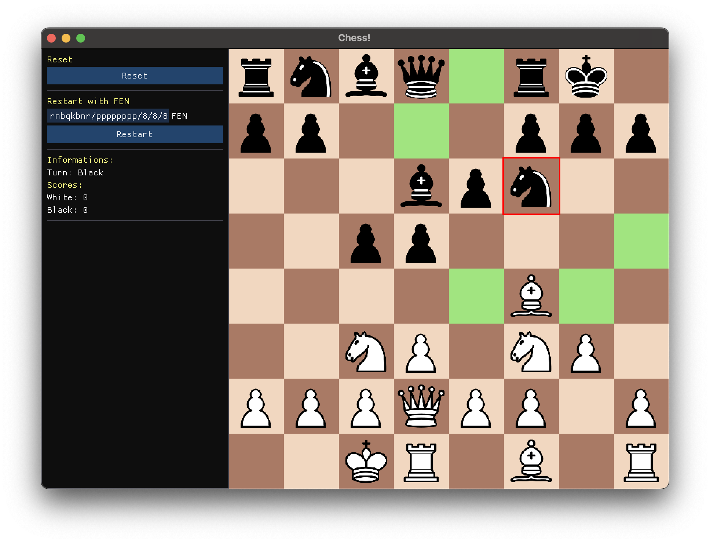

# Chess

Simple 2D Chess Game made with C++ and [SFML](https://github.com/SFML/SFML) (+[ImGui](https://github.com/SFML/imgui-sfml))

## Screenshots

## TODOs

- [x] Pieces
  - [x] Rendering
  - [x] API Implementation
- [x] Board
  - [x] Rendering
  - [x] FEN Parser
- [ ] Movements
  - [ ] Pawn
    - [ ] En Passant
  - [x] Rook
  - [x] Knight
  - [x] Bishop
  - [x] Queen
  - [x] King
    - [x] Castling
  - [ ] Pinned pieces recognition
  - [ ] Check recognition
  - [ ] Checkmate recognition
- [ ] GUI
  - [x] Restart
  - [x] Current turn
  - [x] Current score
  - [ ] Captured pieces icons
- [ ] Windowing
  - [ ] Single UI/Game window
  - [ ] Resizable window

## Credits

- Template: [CMake SFML Template](https://github.com/SFML/cmake-sfml-project)

- Textures: \_I lost track of credits/license of pieces textures... if you know who made them let me know opening an issue in this repo_fml

---

Made with ❤️ by [angelobdev](https://github.com/angelobdev)
